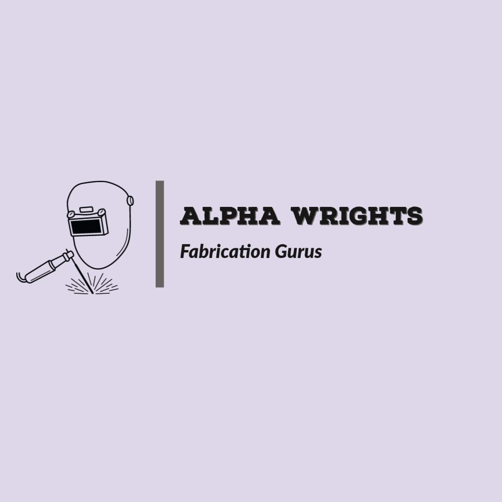

# Alpha Wrights Custom Fabrications



A professional website for Alpha Wrights Custom Fabrications, showcasing premium custom steel and wood fabrications in Roysambu, Nairobi, Kenya. Specializing in welding, live edge furniture, epoxy resin tables, and bespoke metal-wood combinations.

## 🌟 About Us

Alpha Wrights is dedicated to bringing your custom vision to life through expert craftsmanship. We specialize in custom steel and wood fabrications, offering consultation-first services to deliver exceptional quality and precision. Based in Kenya, we pride ourselves on authentic craftsmanship for residential and industrial applications.

## 🛠️ Services

- **Custom Steel Works**: Gates, doors, railings, structures, heavy duty shelves, stairs, steel boxes
- **Furniture**: Coffee tables, dining tables, office desks, shelves, wooden table tops, work tables
- **Home Pictures**: Custom wall art, decorative metal pieces, personalized signage, home decor elements
- **Integrated Steel and Wood Works**: Steel and wood dining tables, custom desks, mixed material shelving, industrial-style furniture

## 📋 Features

- **Responsive Design**: Optimized for desktop and mobile devices
- **Interactive Gallery**: Browse categorized project galleries
- **Contact Form**: Integrated with EmailJS for inquiries
- **Portfolio PDF**: Downloadable portfolio generated from gallery images
- **Blog Section**: Video tutorials and project showcases on [YouTube](https://www.youtube.com/@Fabrication-Gurus)
- **Social Media Integration**: Links to Twitter and TikTok
- **WhatsApp Integration**: Direct contact via WhatsApp

## 🛠️ Tech Stack

- **Frontend**: React 18, TypeScript, Vite
- **Styling**: Tailwind CSS, shadcn/ui components
- **Routing**: React Router DOM
- **Forms**: React Hook Form, Zod validation
- **Email**: EmailJS for contact forms
- **Icons**: Lucide React
- **Charts**: Recharts (if used)
- **Deployment**: Lovable platform

## 🚀 Getting Started

### Prerequisites

- Node.js (v16 or higher)
- npm or yarn

### Installation

1. Clone the repository:
   ```bash
   git clone <YOUR_GIT_URL>
   cd <YOUR_PROJECT_NAME>
   ```

2. Install dependencies:
   ```bash
   npm install
   ```

3. Start the development server:
   ```bash
   npm run dev
   ```

4. Open [http://localhost:8000](http://localhost:8000) in your browser.

### Build for Production

```bash
npm run build
```

### Generate Portfolio PDF

The portfolio PDF is generated from gallery images:

```bash
npm run generate:portfolio
```

This creates a PDF in the `public/` directory.

## 📁 Project Structure

```
src/
├── assets/          # Static assets (logo, images)
├── components/      # Reusable UI components
│   ├── ui/         # shadcn/ui components
│   └── Navigation.tsx, Footer.tsx, etc.
├── hooks/          # Custom React hooks
├── lib/            # Utilities and configurations
├── pages/          # Page components
│   ├── Index.tsx   # Home page
│   ├── Services.tsx
│   ├── Gallery.tsx
│   ├── Contact.tsx
│   ├── Blog.tsx
│   └── NotFound.tsx
└── main.tsx        # App entry point
```

## 📞 Contact

- **Email**: alphawrightsltd@outlook.com
- **Phone**: +254 718 145 608
- **Location**: Roysambu, Nairobi, Kenya
- **WhatsApp**: [Chat on WhatsApp](https://wa.me/254718145608)
- **Twitter**: [@AlphawrightsKe](https://twitter.com/AlphawrightsKe)
- **TikTok**: [@alpha.wrights](https://www.tiktok.com/@alpha.wrights)

## 📄 License

© 2025 Alpha Wrights Custom Fabrications. All rights reserved.

## 🤝 Contributing

This project is maintained by Titus Kamau. For contributions or customizations, please contact Alpha Wrights Custom Fabrications.

---

*Crafting Excellence Through Custom Steel & Wood Fabrications*
